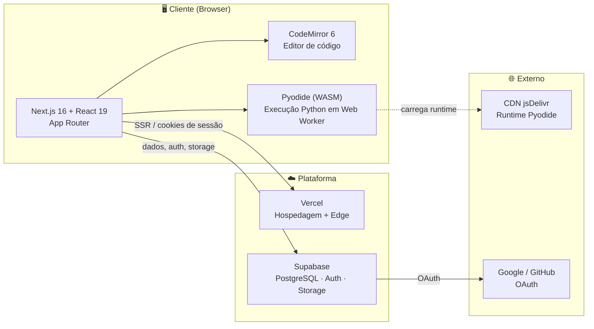

# 01 — Visão Geral

## O que é o LevelUSP

LevelUSP é uma **plataforma web gratuita e gamificada para ensino de programação em Python**, criada como iniciativa da Universidade de São Paulo (USP) para democratizar o acesso ao conhecimento de programação em todo o Brasil. O aluno escreve e executa código Python **diretamente no navegador** — sem instalar nada — resolve exercícios validados por testes automáticos e progride por um sistema de XP, níveis, ofensivas (*streaks*) e ranking.

## Proposta de valor

- **Zero fricção:** o Python roda no próprio navegador (via WebAssembly), sem servidor de execução nem setup local.
- **Aprendizado gamificado:** XP por lição, subida de nível, ofensiva diária, emblemas e ranking global — inspirado em plataformas como Duolingo.
- **Conteúdo criado por educadores:** professores aprovados criam cursos e lições por um painel próprio.
- **Gratuito e em português:** voltado ao público brasileiro, com mensagens de erro de Python traduzidas e explicadas.

## Público-alvo

| Perfil | Necessidade | Papel no sistema |
|--------|-------------|------------------|
| Estudante | Aprender Python do zero ao intermediário | `student` |
| Professor | Criar e publicar cursos/lições | `teacher` |
| Administrador | Gerir usuários, conteúdo e aprovar professores | `admin` |

## Stack tecnológica

### Principais bibliotecas

| Camada | Tecnologia | Uso |
|--------|-----------|-----|
| Framework | **Next.js 16** (App Router, Turbopack) | Roteamento, SSR, middleware |
| UI | **React 19**, **Tailwind CSS 4**, **shadcn/ui** (Radix) | Componentes e estilos |
| Editor | **CodeMirror 6** (`@uiw/react-codemirror`) | Edição de código com realce |
| Execução | **Pyodide 0.25** | CPython em WebAssembly num Web Worker |
| Backend | **Supabase** (`@supabase/ssr`, `@supabase/supabase-js`) | Banco, autenticação, storage |
| Animação | **Framer Motion**, **canvas-confetti** | Gamificação visual |
| Formulários | **React Hook Form** + **Zod** | Validação |
| Drag & drop | **dnd-kit** | Reordenar lições no editor de curso |

## Glossário

| Termo | Definição |
|-------|-----------|
| **Lição** (`lesson`) | Unidade de aprendizado: enunciado em Markdown, código inicial, testes ocultos e recompensa de XP. |
| **Curso** (`course`) | Agrupamento ordenado de lições, com nível e projeto final opcional. |
| **Módulo** (`module`) | Subdivisão temática dentro do conjunto de lições (campo textual em `lessons.module`). |
| **Testes ocultos** (`hidden_tests`) | Código Python (unittest ou `assert`) executado sobre a solução do aluno para validar a resposta. |
| **XP** | Pontos de experiência creditados ao concluir uma lição. |
| **Nível** (`level`) | Derivado do XP total — régua de **1000 XP por nível**. |
| **Ofensiva / Streak** | Dias consecutivos de atividade do aluno. |
| **Emblema** (`badge`) | Conquista desbloqueada por marcos (atualmente em evolução — ver [roadmap](./08-roadmap-tecnico.md)). |
| **RLS** | *Row-Level Security* do PostgreSQL — políticas que restringem o acesso a linhas por usuário/papel. |
| **RBAC** | *Role-Based Access Control* — controle de acesso por papel (`student`/`teacher`/`admin`). |

## Princípios de arquitetura

1. **Execução no cliente.** Todo código Python do aluno roda no navegador (Pyodide). O servidor **não** executa código do usuário — isso elimina uma superfície de ataque inteira e reduz custo de infraestrutura, ao preço de a validação não ser à prova de adversário (ver [avaliador](./05-avaliador-python.md#limitações-conhecidas)).
2. **Supabase como única fonte de verdade.** Dados, autenticação e storage concentrados, com segurança reforçada por RLS no banco.
3. **Defesa em profundidade no acesso.** Proteção de rota em duas camadas: *middleware* (servidor) + verificação no cliente, ambas apoiadas por RLS.
4. **Gamificação como camada.** A lógica de XP/nível vive numa função do banco (`award_xp`), e o visual (modais, partículas, confete) é desacoplado em componentes reutilizáveis.
