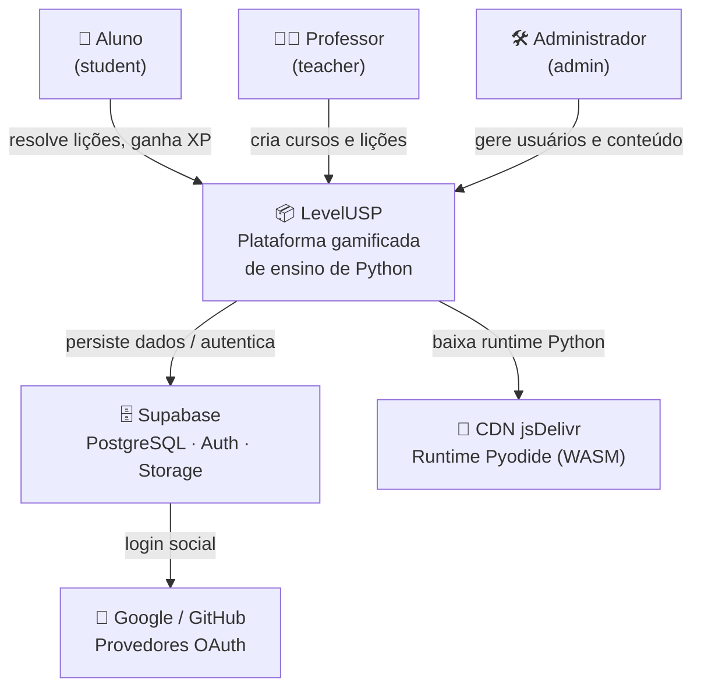
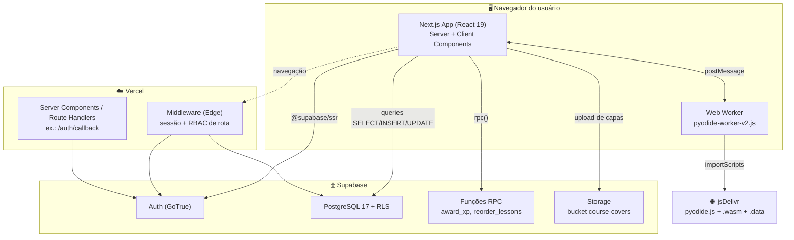
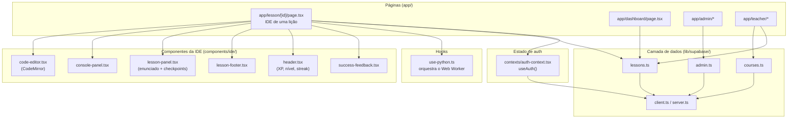

# 02 — Arquitetura

Esta seção descreve a arquitetura do LevelUSP do mais alto nível (contexto) ao mais detalhado (componentes e pastas), seguindo a inspiração do **modelo C4**.

## Nível 1 — Contexto do sistema



## Nível 2 — Contêineres



**Observação importante sobre o caminho quente:** a execução de código Python ocorre **inteiramente no Web Worker do navegador**. O servidor (Vercel) e o banco (Supabase) **não participam** da execução nem da avaliação — só servem o app, a sessão e os dados. O maior custo de rede é o **download único do runtime Pyodide** (~10–30 MB) a partir da CDN.

## Nível 3 — Componentes do cliente



## Estrutura de pastas

```
v0-level-usp-project/
├── app/                      # App Router (rotas)
│   ├── page.tsx              # Landing page (/)
│   ├── login/ · signup/      # Autenticação
│   ├── auth/callback/        # Route handler do OAuth (exchangeCodeForSession)
│   ├── dashboard/            # Painel do aluno (trilha de lições)
│   ├── lesson/[id]/          # IDE de uma lição (núcleo do produto)
│   ├── ide/                  # IDE com lição de fallback
│   ├── cursos/ · cursos/[id] # Catálogo e detalhe de curso
│   ├── leaderboard/          # Ranking global
│   ├── perfil/[username]/    # Perfil público (heatmap, badges, stats)
│   ├── settings/             # Configurações do usuário
│   ├── admin/                # Painel administrativo (RBAC: admin)
│   ├── teacher/              # Painel do professor (RBAC: teacher/admin)
│   ├── error.tsx · not-found.tsx
│   └── layout.tsx            # Layout raiz + metadados + Providers
├── components/
│   ├── ide/                  # Editor, console, painel de lição, header
│   ├── gamification/         # Modais de XP, nível, streak, badge, etc.
│   ├── design-system/        # Botões, badges de XP, progress (tema da marca)
│   ├── profile/              # Heatmap de atividade, badges, stat cards
│   └── ui/                   # shadcn/ui (Radix) — primitivos
├── contexts/
│   └── auth-context.tsx      # Provider de sessão + perfil (useAuth)
├── hooks/
│   └── use-python.ts         # Orquestra o Web Worker do Pyodide
├── lib/
│   ├── supabase/             # client, server, middleware, lessons, courses, admin
│   ├── parse-python-error.ts # Traduz erros de Python para pt-BR
│   └── utils.ts
├── public/
│   ├── pyodide-worker-v2.js  # Web Worker ATIVO (execução + testes)
│   └── pyodide-worker.js     # Versão legada (não usada)
├── supabase/
│   ├── schema.sql            # DDL versionado (ver nota em 03)
│   ├── seed-lessons.sql      # Lições de exemplo
│   └── migrations/           # Migrações incrementais
├── middleware.ts             # Sessão + RBAC de rota (Edge)
└── next.config.mjs           # Headers de segurança, imagens, cache
```

## Decisões arquiteturais e seus *trade-offs*

| Decisão | Benefício | Custo / Risco |
|---------|-----------|---------------|
| Execução Python **no cliente** (Pyodide) | Sem servidor de execução; escala trivial; custo de infra baixo | Validação não é à prova de adversário; download pesado do runtime |
| **Supabase** como BaaS | Auth + DB + Storage integrados; RLS forte | Acoplamento ao fornecedor; lógica de negócio dividida entre app e SQL |
| **Web Worker** dedicado | UI não congela durante execução | Comunicação assíncrona por mensagens; sem isolamento entre aluno e gabarito (ver 05) |
| **Middleware + RLS** (dupla proteção) | Defesa em profundidade | Lógica de papel duplicada (servidor e banco) |
| Componentes de gamificação **desacoplados** | Reúso e testabilidade visual | Vários modais ainda não conectados a gatilhos (ver roadmap) |

> Para o modelo de dados detalhado, ver [03 — Banco de dados](./03-banco-de-dados.md). Para os fluxos de execução, ver [04 — Fluxos](./04-fluxos.md) e [05 — Avaliador Python](./05-avaliador-python.md).
