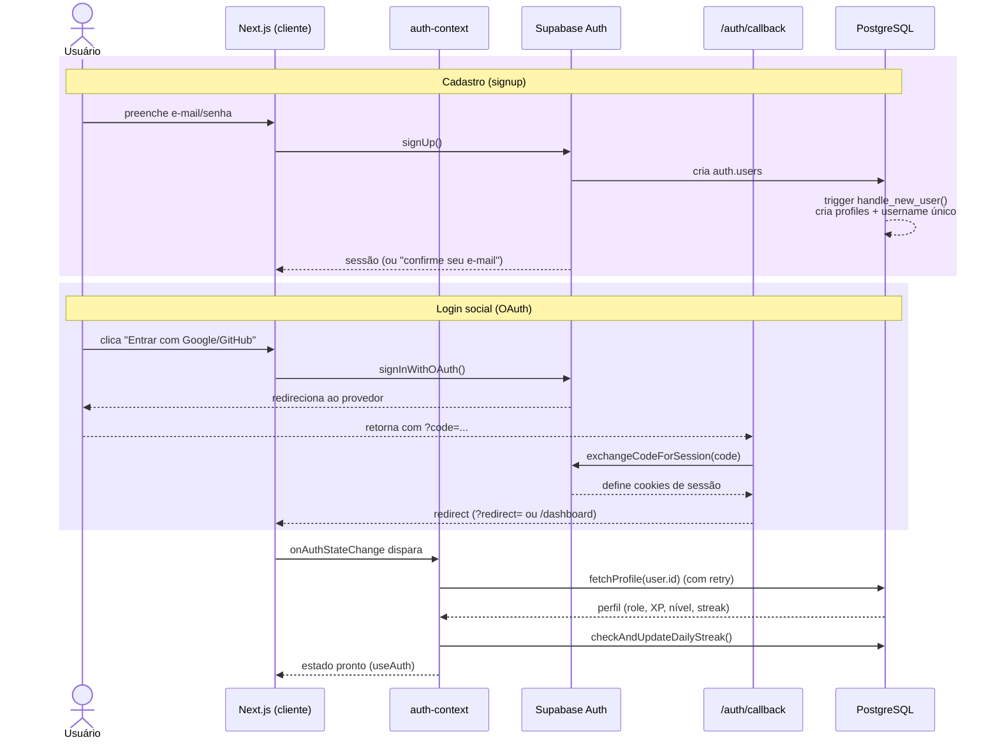
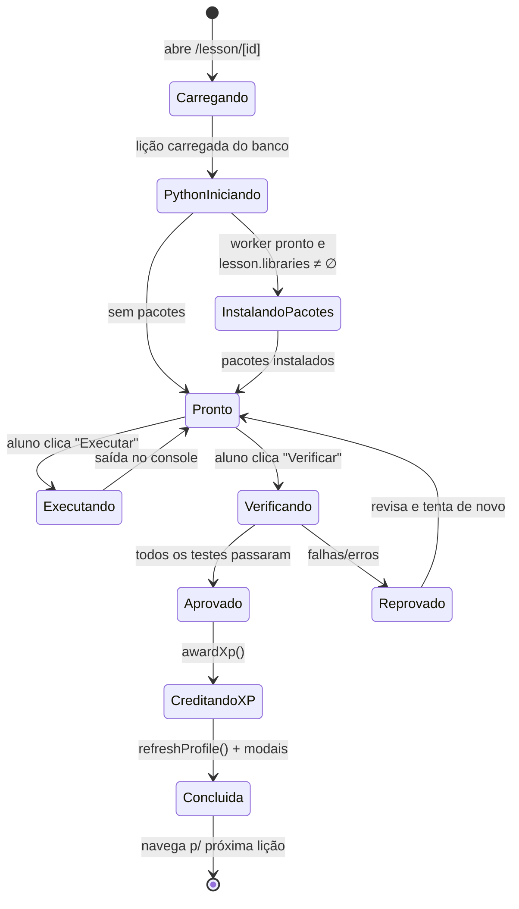
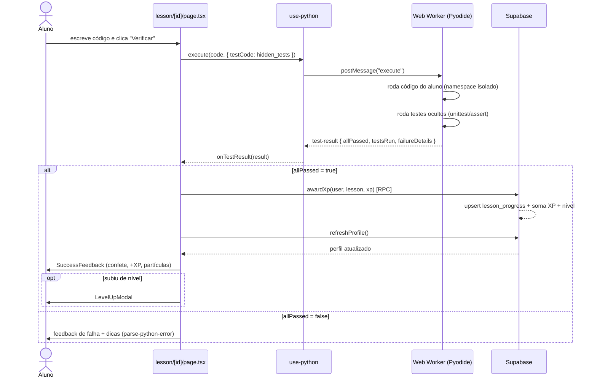
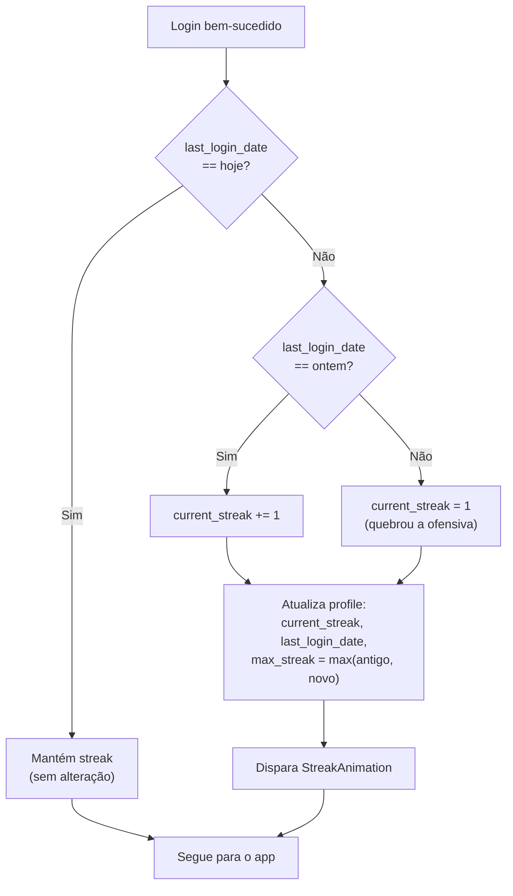
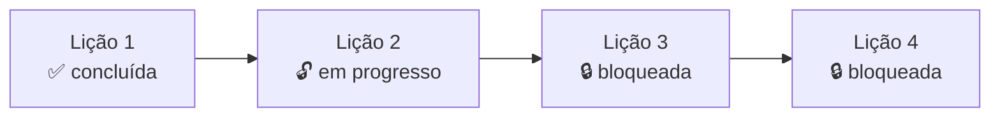
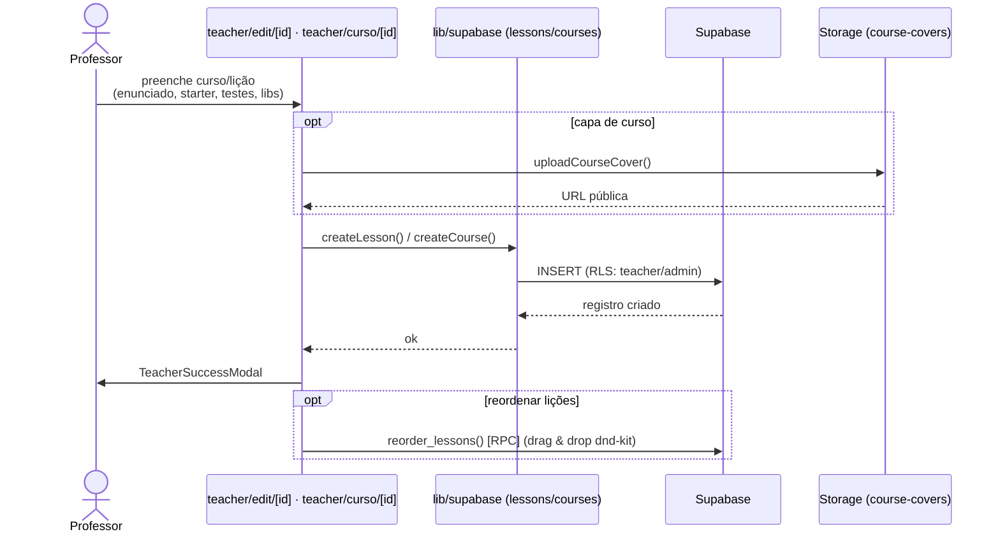

# 04 — Fluxos Principais

Diagramas de sequência e estado dos fluxos centrais. Para o detalhe interno da execução Python, ver [05 — Avaliador Python](./05-avaliador-python.md).

## 1. Autenticação (e-mail/senha e OAuth)

**Pontos de implementação:**
- `contexts/auth-context.tsx` usa um cliente Supabase *singleton* e ouve `onAuthStateChange`, com *retry* em `fetchProfile` para tolerar latência da trigger/RLS recém-criada.
- `app/auth/callback/route.ts` troca o `code` por sessão e respeita o parâmetro `?redirect=`.
- O cadastro suporta confirmação de e-mail opcional (se ativada no Supabase).

## 2. Ciclo de vida de uma lição (estado da IDE)

## 3. Resolver lição → validar → ganhar XP (fim a fim)

> **Nota de integridade.** O mecanismo de validação atual tem limitações conhecidas (falsos positivos no modo `assert`, possibilidade de burla por namespace compartilhado, dupla execução do código do aluno). Esses pontos estão detalhados e priorizados em [05 — Avaliador Python](./05-avaliador-python.md#limitações-conhecidas) e no [roadmap](./08-roadmap-tecnico.md).

## 4. Ofensiva diária (streak)

Implementado em `checkAndUpdateDailyStreak` ([`lib/supabase/lessons.ts`](../lib/supabase/lessons.ts)), chamado no login.

## 5. Desbloqueio sequencial de lições

A trilha do aluno libera lições em sequência: uma lição só abre após a anterior estar **concluída**.

Lógica pura em `computeModuleStatuses` ([`lib/supabase/lessons.ts`](../lib/supabase/lessons.ts)): percorre as lições ordenadas e marca `completed` / `in-progress` / `locked` conforme o progresso. Por ser função pura, é trivialmente testável.

## 6. Criação de conteúdo pelo professor

