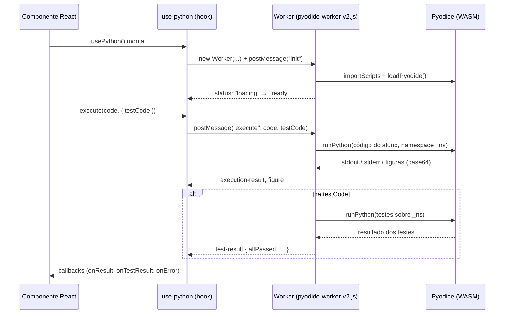
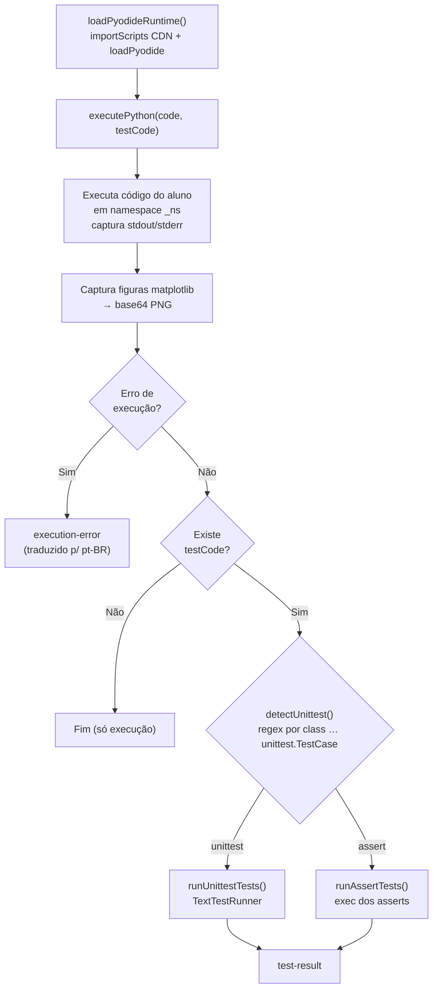
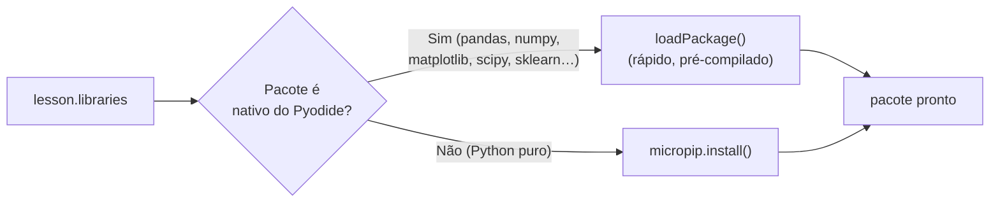
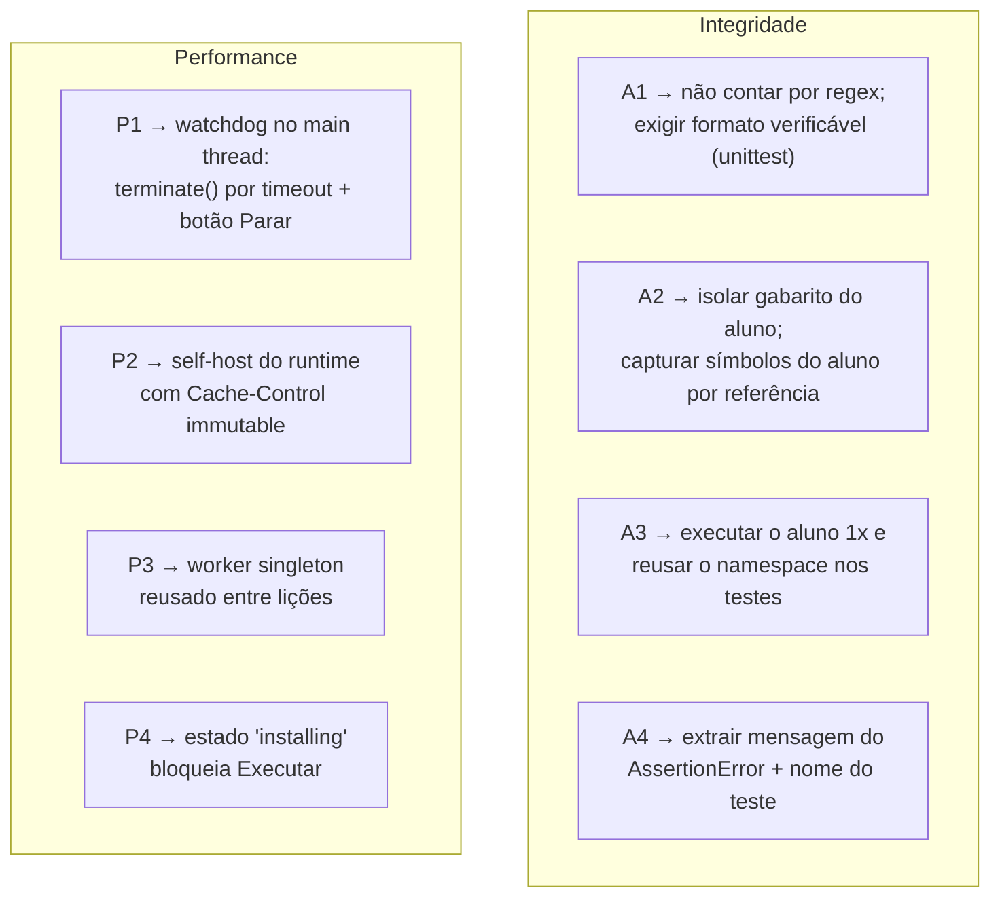

# 05 — Avaliador Python (Pyodide)

Este é o **núcleo do produto**: o subsistema que executa o código do aluno e decide se a solução está correta. Tudo roda **no navegador**, dentro de um Web Worker, usando **Pyodide** (CPython compilado em WebAssembly).

Arquivos:
- [`public/pyodide-worker-v2.js`](../public/pyodide-worker-v2.js) — o Web Worker **ativo**.
- [`hooks/use-python.ts`](../hooks/use-python.ts) — hook React que orquestra o worker via mensagens.
- [`lib/parse-python-error.ts`](../lib/parse-python-error.ts) — traduz erros do Python para pt-BR.
- `public/pyodide-worker.js` — versão **legada** (não utilizada).

## Visão geral da comunicação

## Ciclo de execução interno (worker)

## Os dois modos de teste

O professor escreve os **testes ocultos** (`hidden_tests`) em um de dois formatos, detectados automaticamente:

### Modo `unittest`
Detectado quando o código contém `class ... (unittest.TestCase)`. O worker:
1. Executa o código do aluno num namespace `_ns`, injetando `_stdout` (saída do aluno) e `_source` (código-fonte) como auxiliares.
2. Executa os testes no **mesmo** namespace.
3. Descobre as `TestCase`, roda com `unittest.TextTestRunner` e reporta `testsRun`, `failures`, `errors`, `allPassed` e `failureDetails`.

### Modo `assert`
Usado quando não há classe `unittest`. O worker executa o bloco de `assert`s no namespace do aluno; se nenhuma exceção for lançada, considera aprovado.

## Pacotes Python

Após carregar `matplotlib`, o backend é fixado em `agg` para permitir capturar figuras como PNG.

## Tratamento de erros

`lib/parse-python-error.ts` mapeia ~14 padrões de exceção (SyntaxError, NameError, TypeError, IndentationError, etc.) para `{ título, explicação, dica }` em português, com *fallback* genérico. Isso transforma stacktraces crípticos em feedback didático.

---

## Limitações conhecidas

> Esta subseção documenta **dívida técnica real** do avaliador, identificada em auditoria. São itens priorizados no [roadmap](./08-roadmap-tecnico.md). Estão aqui para que qualquer mantenedor entenda os riscos antes de confiar 100% no veredito automático.

### 🔴 Correção / integridade da avaliação

| ID | Problema | Efeito |
|----|----------|--------|
| **A1** | No **modo `assert`**, a quantidade de testes é contada por *regex* de texto (`/^\s*assert\s/gm`) e o resultado é "aprovado" desde que **nenhuma exceção** seja lançada. Um `testCode` sem asserção efetiva no nível superior (ou com asserts dentro de função nunca chamada) é marcado como aprovado. | **Falsos positivos** — aluno "passa" sem resolver. |
| **A2** | Código do aluno e testes rodam no **mesmo namespace** `_ns`, e o do aluno roda **primeiro**. O aluno pode redefinir `AssertionError`/`unittest` ou pré-setar variáveis que os testes checam. | **Burla** da validação. |
| **A3** | O código do aluno é executado **duas vezes** (execução principal + de novo dentro dos testes). | Efeitos colaterais (contadores, `input()`, I/O) divergem → veredito inconsistente; CPU desperdiçada. |
| **A4** | No modo unittest, `failureDetails` extrai só a **última linha** do traceback. | Feedback de falha pobre. |

### 🟡 Performance / uso de recursos

| ID | Problema | Efeito |
|----|----------|--------|
| **P1** | **Não há timeout** de execução nem botão "Parar". Pyodide é síncrono no worker. | `while True:` trava o worker indefinidamente; aba consome CPU sem recuperação. |
| **P2** | Runtime Pyodide (~10–30 MB) é baixado da **CDN jsDelivr a cada sessão**, sem cache controlado pela app (o `next.config.mjs` só faz cache do worker de ~3 KB). | Lento e caro em dados — crítico para o público nacional em redes variadas. |
| **P3** | O worker é **recriado e `terminate()`** a cada montagem do hook, recarregando o Pyodide inteiro a cada navegação entre lições. | Tempo e memória desperdiçados. |
| **P4** | `installPackages` é assíncrono e o `execute` **não espera** terminar. | `ModuleNotFoundError` espúrio se o aluno rodar antes do pacote carregar. |
| **P5** | Versão do Pyodide (`v0.25.1`) é fixa e dependente da CDN externa. | Quebra se a CDN ficar indisponível; sem *self-host*. |

### Estratégias de mitigação propostas

> **Limite arquitetural inerente:** como o Pyodide roda **no cliente**, um aluno determinado sempre pode inspecionar e forjar resultados pelas ferramentas do navegador. As mitigações de A1/A2 visam impedir **burla trivial/acidental** e tornar o veredito **correto** — não criar antifraude à prova de adversário. Validação à prova de adversário exigiria **execução server-side** (sandbox de Python isolado), o que está fora do escopo atual e é registrado como evolução futura no [roadmap](./08-roadmap-tecnico.md).
