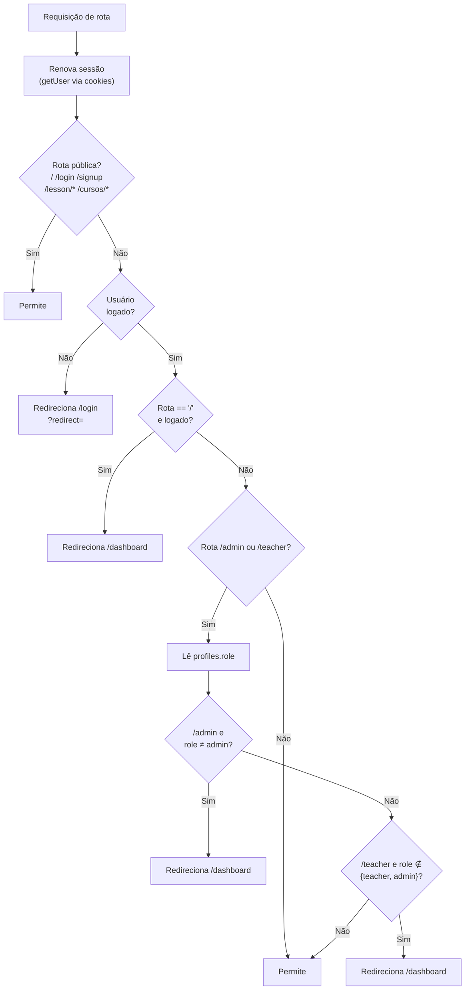
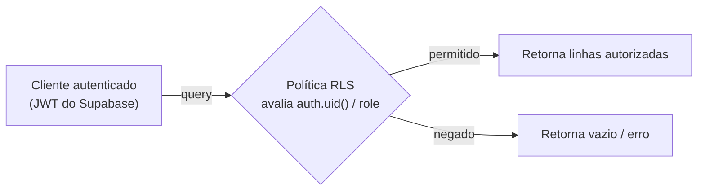

# 06 — Segurança e Controle de Acesso (RBAC)

O LevelUSP adota **defesa em profundidade**: o acesso é controlado em duas camadas complementares — *middleware* na borda (rota) e *Row-Level Security* no banco (linha) — sobre uma base de autenticação do Supabase.

## Papéis (roles)

| Papel | Pode |
|-------|------|
| `student` | Resolver lições, ver cursos/ranking/perfil, editar o próprio perfil |
| `teacher` | Tudo do `student` + criar/editar/publicar **seus** cursos e lições |
| `admin` | Tudo + gerir usuários, ver todo o conteúdo, aprovar professores, auditar |

O papel vive em `profiles.role` (`CHECK IN ('student','teacher','admin')`).

## Camada 1 — Middleware (proteção de rota, na borda)

`middleware.ts` → `lib/supabase/middleware.ts` (`updateSession`) roda em **toda navegação** (exceto assets estáticos). Ele renova a sessão via cookies e aplica RBAC de rota.



**Decisão de design (tolerância a falha):** se a consulta de `role` falhar (erro de banco/RLS), o middleware **deixa passar** e delega ao cliente, em vez de redirecionar. Isso evita *loops* de redirecionamento e telas brancas por erro transitório — ao custo de não barrar na borda nesse caso de exceção (o RLS no banco continua protegendo os dados).

## Camada 2 — Row-Level Security (proteção de dados, no banco)

Mesmo que uma requisição alcance uma rota, **o banco só devolve as linhas que a política permite**. Exemplos:
- Um `student` que tente ler `lesson_progress` de outro usuário recebe **zero linhas**.
- Apenas `teacher`/`admin` conseguem `INSERT` em `lessons`.
- `award_xp` usa `SECURITY DEFINER` para escrever de forma controlada sem expor `UPDATE` direto de XP ao cliente.



Ver o detalhamento das políticas por tabela em [03 — Banco de dados](./03-banco-de-dados.md#row-level-security-rls).

## Autenticação

- **Provedores:** e-mail/senha + OAuth (Google, GitHub), via `@supabase/ssr`.
- **Sessão:** baseada em cookies, renovada pelo middleware a cada navegação.
- **Provisionamento de perfil:** trigger `handle_new_user` cria o `profiles` no cadastro, derivando `username` único.
- **Recuperação de senha:** `resetPasswordForEmail` nas telas de login/configurações.

## Cabeçalhos de segurança (HTTP)

Definidos em `next.config.mjs` para todas as rotas:

| Cabeçalho | Valor | Propósito |
|-----------|-------|-----------|
| `X-Content-Type-Options` | `nosniff` | Evita *MIME sniffing* |
| `X-Frame-Options` | `DENY` | Anti-*clickjacking* |
| `X-XSS-Protection` | `1; mode=block` | Mitigação XSS (navegadores legados) |
| `Referrer-Policy` | `strict-origin-when-cross-origin` | Limita vazamento de *referrer* |
| `Permissions-Policy` | `camera=(), microphone=(), geolocation=()` | Bloqueia APIs sensíveis |

## Gestão de segredos — ⚠️ ação requerida

> 🔴 **Risco conhecido.** O arquivo [`.env`](../.env) está **versionado no Git** contendo credenciais reais (senha do Postgres, *service role key*, *JWT secret*). O `.gitignore` ignora apenas `.env*.local`, não `.env`.

**Boas práticas a aplicar (ver [roadmap](./08-roadmap-tecnico.md) e [setup](./07-setup-e-deploy.md)):**
1. Adicionar `.env` ao `.gitignore` e removê-lo do versionamento (`git rm --cached .env`).
2. **Rotacionar** as chaves expostas no painel do Supabase (service role, JWT secret, senha do banco).
3. Manter apenas as chaves públicas (`NEXT_PUBLIC_*`) no cliente; *service role* nunca deve ir ao navegador.
4. Configurar variáveis de ambiente diretamente na Vercel (não no repositório).

### O que o cliente realmente precisa

Apenas estas duas variáveis públicas são usadas pelo runtime do navegador:

```
NEXT_PUBLIC_SUPABASE_URL
NEXT_PUBLIC_SUPABASE_ANON_KEY
```

A `anon key` é segura para exposição **porque o RLS é a real linha de defesa** — ela só permite o que as políticas autorizam para o usuário autenticado.
