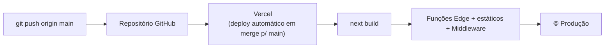

# 07 — Setup e Deploy

## Pré-requisitos

| Ferramenta | Versão recomendada |
|-----------|--------------------|
| Node.js | ≥ 20 LTS |
| Gerenciador de pacotes | `pnpm` (há `pnpm-lock.yaml`) ou `npm` |
| Conta Supabase | projeto PostgreSQL + Auth + Storage |
| Conta Vercel | para deploy (opcional em dev) |

## Variáveis de ambiente

Crie um arquivo **`.env.local`** (ignorado pelo Git) a partir de [`.env.local.example`](../.env.local.example):

```bash
# Públicas — usadas pelo cliente (seguras de expor; o RLS é a defesa real)
NEXT_PUBLIC_SUPABASE_URL=https://<seu-projeto>.supabase.co
NEXT_PUBLIC_SUPABASE_ANON_KEY=<sua-anon-key>
```

> ⚠️ **Nunca** versione `.env`/`.env.local` nem coloque a *service role key* no cliente. Veja a [gestão de segredos](./06-seguranca-rbac.md#gestão-de-segredos--ação-requerida). Em produção, defina as variáveis no painel da **Vercel**.

## Banco de dados

1. No SQL Editor do Supabase, rode [`supabase/schema.sql`](../supabase/schema.sql) para criar `profiles`, `lessons`, `lesson_progress`, funções e triggers.
2. (Opcional) Rode [`supabase/seed-lessons.sql`](../supabase/seed-lessons.sql) para popular lições de exemplo.
3. Aplique as migrações em [`supabase/migrations/`](../supabase/migrations/).
4. Crie o bucket público **`course-covers`** (Storage) para capas de curso.

> ⚠️ **Atenção:** o `schema.sql` versionado está **desatualizado** em relação ao banco em produção (faltam `courses`, `enrollments`, `teacher_approvals`, `audit_log`, a função `reorder_lessons` e colunas de `lessons`). Para reproduzir o ambiente completo hoje, gere o DDL a partir do projeto de referência ou aguarde a sincronização prevista no [roadmap](./08-roadmap-tecnico.md).

## Rodando localmente

```bash
pnpm install          # ou: npm install
pnpm dev              # ou: npm run dev
# abre http://localhost:3000
```

| Script | Ação |
|--------|------|
| `pnpm dev` | Servidor de desenvolvimento (Turbopack) |
| `pnpm build` | Build de produção |
| `pnpm start` | Serve o build de produção |
| `pnpm lint` | ESLint |

## Build de produção

```bash
pnpm build
```

> 🔴 **Problema conhecido (bloqueador).** No Next.js 16.2.0, `next build` pode falhar no *type-check* com
> `Type error: The left-hand side of an arithmetic operation must be of type 'any', 'number', 'bigint'...`
> apontando para `.next/dev/types/validator.ts`. A causa é um **bug de geração de tipos do próprio Next** (um comentário malformado para a rota `/`), **não** do código da aplicação. Mitigação e contexto completos no [roadmap](./08-roadmap-tecnico.md#bloqueador-build).

## Deploy (Vercel)



1. Conecte o repositório à Vercel.
2. Defina as variáveis `NEXT_PUBLIC_SUPABASE_URL` e `NEXT_PUBLIC_SUPABASE_ANON_KEY` no projeto da Vercel.
3. Em **Authentication → URL Configuration** no Supabase, inclua a URL de produção e a rota de callback (`/auth/callback`) nas *Redirect URLs*.
4. Cada *merge* em `main` dispara deploy automático.

## Cache e performance

- O `next.config.mjs` define cabeçalhos de segurança e cache do worker do Pyodide.
- **Recomendação de evolução:** *self-host* + cache `immutable` do runtime Pyodide (hoje vindo da CDN jsDelivr) e reuso do Web Worker entre lições — ver [avaliador](./05-avaliador-python.md#-performance--uso-de-recursos) e [roadmap](./08-roadmap-tecnico.md).

## Solução de problemas

| Sintoma | Causa provável | Ação |
|--------|----------------|------|
| `next build` falha no type-check | Bug de codegen do Next 16 | Ver [roadmap](./08-roadmap-tecnico.md#bloqueador-build) |
| Login funciona mas perfil vem vazio | Latência da trigger/RLS | O `auth-context` já faz *retry*; confirme se a trigger `handle_new_user` existe |
| `ModuleNotFoundError` ao rodar lição com pandas/numpy | Aluno executou antes do pacote instalar | Aguardar instalação (ver melhoria P4 no [avaliador](./05-avaliador-python.md)) |
| Aba travada ao rodar código | Loop infinito sem timeout | Recarregar a aba (timeout planejado — P1 no [avaliador](./05-avaliador-python.md)) |
| Imagem de capa não carrega | `remotePatterns` / bucket | Conferir `next.config.mjs` e se o bucket `course-covers` é público |
