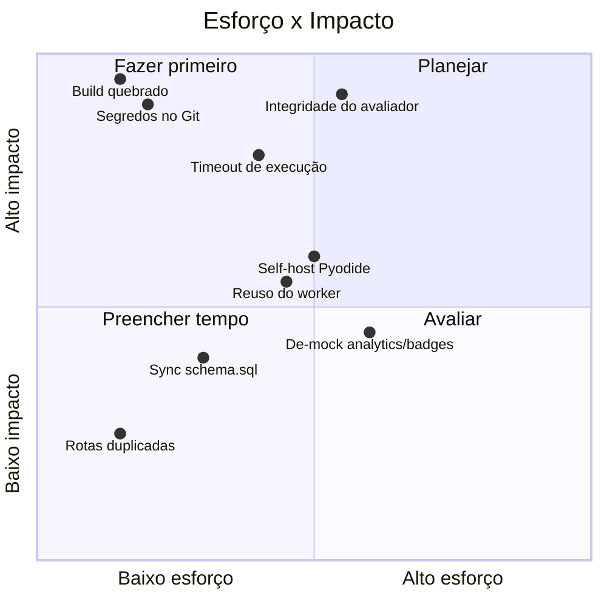
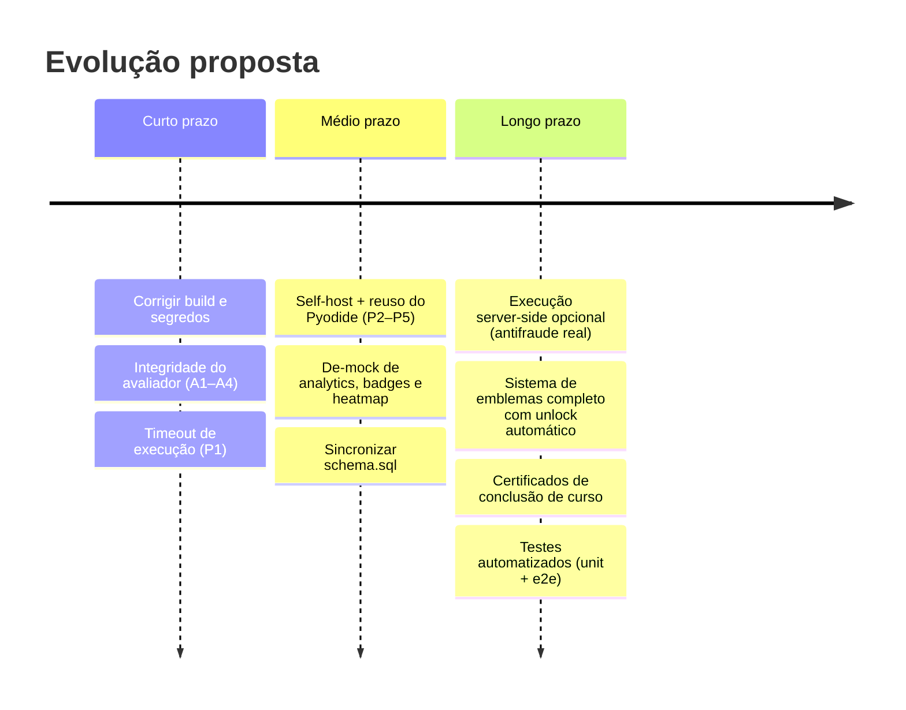

# 08 — Roadmap Técnico e Dívidas Conhecidas

Consolidação das dívidas técnicas e melhorias planejadas, priorizadas. A legenda de severidade segue o [README](./README.md#convenções).

## Priorização

## 🔴 Bloqueadores

### Build de produção quebrado
- **Sintoma:** `next build` falha no *type-check* em `.next/dev/types/validator.ts` com erro de "operação aritmética".
- **Causa raiz:** bug de geração de tipos do **Next.js 16.2.0** — o validador gerado emite, para a rota raiz, um comentário sem o prefixo `//` (`/../app/page.tsx`), que o TypeScript interpreta como divisão. O erro está no **arquivo gerado pelo framework**, não em `app/page.tsx` (que é válido). Como o `tsconfig.json` inclui `.next/dev/types/**/*.ts`, o artefato entra no type-check.
- **Mitigação recomendada:** definir `typescript: { ignoreBuildErrors: true }` em `next.config.mjs`. O type-check real continua disponível via `tsc --noEmit` (que não inclui os tipos `dev/`). Alternativa frágil: limpar `.next` e rebuildar.

### Segredos versionados
- **Sintoma:** `.env` com credenciais reais commitado.
- **Ação:** remover do Git (`git rm --cached .env` + `.gitignore`), **rotacionar** chaves no Supabase, mover config para a Vercel. Detalhes em [06 — Segurança](./06-seguranca-rbac.md#gestão-de-segredos--ação-requerida).

## 🔴 Integridade do avaliador Python

Detalhado em [05 — Avaliador](./05-avaliador-python.md#limitações-conhecidas). Resumo dos itens e correção alvo:

| ID | Item | Correção alvo |
|----|------|---------------|
| A1 | Modo `assert` gera falsos positivos | Não contar por regex; padronizar formato verificável |
| A2 | Burla por namespace compartilhado | Isolar gabarito; capturar símbolos do aluno por referência |
| A3 | Código do aluno executa 2× | Executar 1× e reusar o namespace nos testes |
| A4 | Feedback de falha pobre | Extrair mensagem do `AssertionError` + nome do teste |

## 🟡 Performance / recursos (avaliador)

| ID | Item | Correção alvo |
|----|------|---------------|
| P1 | Sem timeout / sem botão Parar | *Watchdog* no main thread + `worker.terminate()` por tempo (usar `lessons.time_limit`) |
| P2 | Pyodide baixado da CDN a cada sessão | *Self-host* com `Cache-Control: immutable` |
| P3 | Worker recriado a cada lição | Worker *singleton* reusado entre navegações |
| P4 | Pacotes sem aguardar instalação | Estado `installing` que bloqueia Executar |
| P5 | Pyodide fixo e dependente da CDN | Fixar versão e *self-host* |

## 🟡 Dados e conteúdo

| Item | Situação | Ação |
|------|----------|------|
| `schema.sql` desatualizado | Só 3 das 7 tabelas reais | Sincronizar DDL versionado com o banco em produção |
| Analytics do admin | Dados *mockados* (funil, erros, coortes) | Derivar de `lesson_progress`/`audit_log`; remover cards sem fonte |
| Badges | `mockBadges` *hardcoded* | Criar tabelas `badges`/`user_badges` + regras de unlock + conectar `badge-earned-modal` |
| Heatmap de atividade | `generateMockActivityData()` | `fetchUserActivity` agregando `lesson_progress.completed_at` |
| Settings do admin | Não persiste | Tabela `platform_settings` + `fetch/update` |

## 🟢 Limpeza

| Item | Ação |
|------|------|
| Rotas duplicadas `/` e `/landing` | Remover/redirecionar `/landing` |
| `/showcase` (demo do design system) | Restringir a dev ou remover do menu |
| Modais de gamificação órfãos (`course-complete`, `enrollment`, `teacher-success`, `streak`) | Conectar aos gatilhos correspondentes |
| `pyodide-worker.js` legado | Remover (worker ativo é o `-v2`) |
| Aviso `middleware` deprecado (Next 16) | Migrar para convenção `proxy` |
| `file-explorer.tsx` | Operações de arquivo (renomear/duplicar/excluir) são apenas UI |

## Evolução futura (além do escopo atual)

> **Nota sobre antifraude.** A validação 100% à prova de adversário exigiria executar o Python **no servidor**, em sandbox isolado. Isso reintroduz custo e superfície de ataque que a arquitetura atual evita de propósito. É uma decisão de produto: manter a execução no cliente (barato, escalável, mas burlável por usuário avançado) ou oferecer um caminho server-side para avaliações que exijam integridade forte (ex.: provas).
