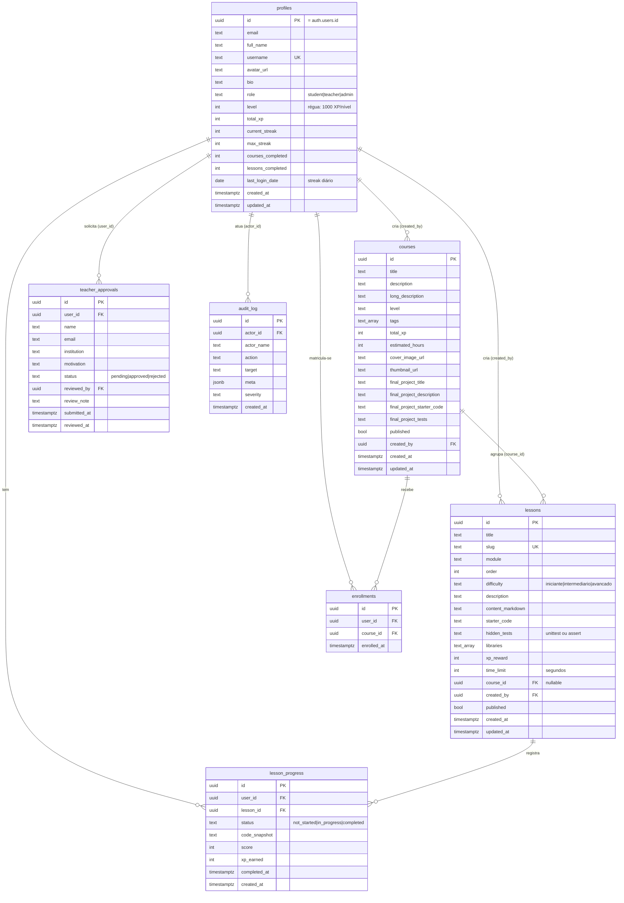
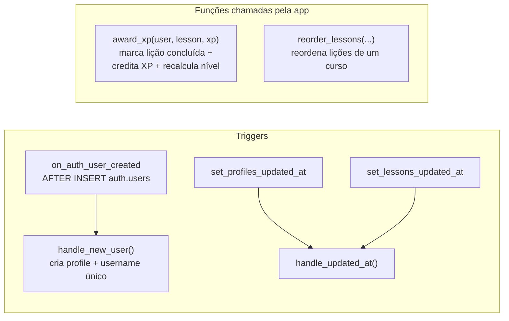

# 03 — Banco de Dados

O LevelUSP usa **PostgreSQL 17** gerenciado pelo Supabase, com **Row-Level Security (RLS)** habilitado em todas as tabelas de domínio. Esta seção documenta o modelo de dados **conforme o banco em produção** (verificado via inspeção do schema ao vivo).

> ✅ **Sincronização (2026-07-14).** O arquivo versionado [`supabase/schema.sql`](../supabase/schema.sql) foi regenerado a partir do banco ao vivo e é a **fonte de verdade** do DDL: 19 tabelas (as 7 originais + `platform_settings`, `notifications`, `badges`, `user_badges`, `modules`, `library_catalog`, `library_requests`, `notes`, `exams`, `exam_questions`, `exam_attempts`, `certificates`), funções, triggers, policies, grants por coluna e policies de storage. O ERD abaixo cobre o núcleo original; para as tabelas de prova/certificação ver [09-prova-certificacao.md](./09-prova-certificacao.md).

## Modelo entidade-relacionamento (ERD)

## Dicionário de dados (resumo por tabela)

### `profiles`
Estende `auth.users` (chave primária compartilhada). Criada automaticamente no cadastro pela trigger `handle_new_user`, que deriva `full_name` e um `username` único a partir dos metadados de OAuth ou do e-mail. Concentra o estado de gamificação (XP, nível, streak).

| Restrição/Regra | Detalhe |
|---|---|
| `id` | FK para `auth.users(id)` com `ON DELETE CASCADE` |
| `role` | `CHECK IN ('student','teacher','admin')`, padrão `student` |
| `level` | recalculado por `award_xp`: `GREATEST(1, FLOOR(total_xp/1000)+1)` |
| `username` | `UNIQUE` |

### `lessons`
Unidade central de aprendizado. `hidden_tests` guarda o código de validação (ver [avaliador](./05-avaliador-python.md)). `libraries` lista pacotes Python a instalar no Pyodide. `course_id` é opcional (lições podem existir soltas).

### `courses`
Agrupa lições e define metadados de trilha (nível, tags, horas estimadas, projeto final). Capa armazenada no bucket `course-covers`.

### `lesson_progress`
Progresso por par (usuário, lição) — `UNIQUE(user_id, lesson_id)`. Atualizado idempotentemente por `award_xp` via `ON CONFLICT`.

### `enrollments`
Matrícula de um usuário em um curso. Relação N:N entre `profiles` e `courses`.

### `teacher_approvals`
Fila de solicitações para virar professor; aprovada/rejeitada por um admin no painel.

### `audit_log`
Trilha de auditoria de ações administrativas (ator, ação, alvo, severidade, metadados em `jsonb`).

## Funções (RPC) e triggers

### `award_xp(p_user_id, p_lesson_id, p_xp)`
Coração da gamificação no banco. Em uma transação:
1. *Upsert* em `lesson_progress` marcando a lição como `completed` (idempotente).
2. Soma `p_xp` a `profiles.total_xp`, incrementa `lessons_completed` e recalcula `level` pela régua de 1000 XP/nível.

`SECURITY DEFINER` — executa com privilégios do dono, contornando RLS de escrita de forma controlada.

## Row-Level Security (RLS)

Todas as tabelas de domínio têm RLS habilitado. Padrões principais:

| Tabela | Leitura | Escrita |
|--------|---------|---------|
| `profiles` | pública (`USING true`) | própria linha; admin pode qualquer uma |
| `lessons` | publicadas para todos; professores/admin veem todas | professores/admin criam; autor ou admin editam |
| `lesson_progress` | própria linha; professores/admin veem todas | própria linha (insert/update) |
| `courses` / `enrollments` | publicadas / próprias | regras por papel |

> A combinação **middleware (rota) + RLS (linha)** forma a defesa em profundidade descrita em [06 — Segurança e RBAC](./06-seguranca-rbac.md).

## Storage

| Bucket | Acesso | Uso |
|--------|--------|-----|
| `course-covers` | público | Imagens de capa de curso (upload pelo editor de curso). Servido via `next/image` com `remotePatterns` para `*.supabase.co`. |
