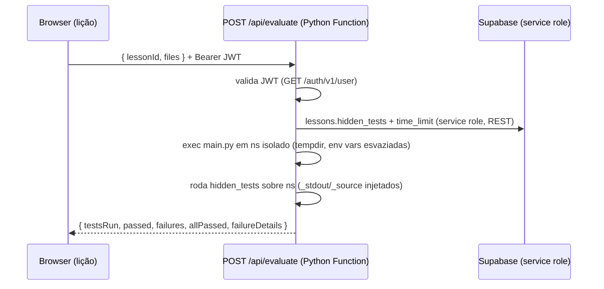

# 05 — Avaliador Python

O avaliador tem **duas metades** com papéis distintos:

| Onde | O quê | Arquivo |
|------|-------|---------|
| **Navegador** (Pyodide em Web Worker) | Execução livre: botão "Executar", console interativo, figuras matplotlib | `public/pyodide-worker-v2.js` |
| **Servidor** (Vercel Python Function, CPython real) | Verificação oficial: botão "Verificar Resposta" roda os `hidden_tests` | `api/evaluate.py` (config em `vercel.json`) |

**Regra de ouro:** `hidden_tests` NUNCA chega ao navegador. O grant de SELECT em `lessons` é por coluna e exclui `hidden_tests`; a verificação acontece exclusivamente em `POST /api/evaluate`.

## Fluxo de verificação (server-side)

O cliente (`lib/evaluate.ts`) só recebe o veredito. Em caso de aprovação, o
cliente chama `award_xp` (RPC endurecida: só o próprio usuário, XP real da lição).

## Regras de fluxo no IDE

- O botão **Verificar** só habilita depois de uma execução **sem erros** do
  projeto (estado `canVerify` em `contexts/ide-context.tsx`). Editar o código,
  criar/renomear/excluir arquivo ou resetar o projeto exige rodar de novo.
- A execução livre continua 100% no cliente (não consome servidor).

## Os dois modos de teste

Detectados automaticamente pelo conteúdo de `hidden_tests`:

### Modo `unittest`
Quando há `class ... (unittest.TestCase)`. O runner descobre as TestCase,
executa com `TextTestRunner` e reporta `testsRun/failures/errors/failureDetails`
com o nome do teste + mensagem da asserção.

### Modo `assert`
Blocos de `assert` simples. O total esperado é contado por **AST**
(`ast.Assert`), não por regex; um gabarito sem asserts reprova com aviso.

Em ambos os modos os testes rodam **no mesmo namespace** da execução do aluno
(sem re-executar o código), com sentinelas injetadas **depois** do exec:

- `_stdout` — saída capturada do aluno
- `_source` — código-fonte do aluno (para asserts de estilo, ex.: "use lambda")
- `__builtins__`, `AssertionError`, `unittest` — protegidos contra sobrescrita

## Timeout

- **Cliente:** watchdog de 10s no hook (`use-python.ts`) — `replaceWorker()`
  mata o worker e reinicializa.
- **Servidor:** a avaliação roda numa thread daemon com `join(timeout)`
  (5–25s conforme `time_limit` da lição) + `maxDuration: 30` no `vercel.json`
  como backstop. Timeout responde HTTP 408. Durante a execução do código do
  aluno, as variáveis de ambiente são esvaziadas (anti-exfiltração de segredos).

## Pacotes Python

Igual nas duas metades: pacotes nativos do Pyodide 0.25.1 (numpy, pandas,
matplotlib, sklearn…) via `loadPackage`; pure-Python via `micropip`. O worker
do navegador é **singleton** (`lib/pyodide-worker-singleton.ts`) — navegar
entre lições não recarrega o runtime, e os pacotes instalados persistem na
sessão. No servidor, a instância Pyodide e o cache de pacotes persistem
enquanto a lambda estiver quente.

## Prova teórica e projeto final

- A prova final usa o mesmo princípio: `exam_questions.correct_index` é
  **deny-all** para clientes (RLS sem policy); correção em
  `POST /api/exam/[courseId]/submit`. Ver [09-prova-certificacao.md](./09-prova-certificacao.md).
- O projeto final de cada curso é uma lição `coding` com `hidden_tests`
  em formato unittest — mesma engrenagem, mesma segurança.

## Tratamento de erros

`lib/parse-python-error.ts` mapeia ~14 padrões de exceção para
`{ título, explicação, dica }` em português (usado na execução livre do
cliente). No servidor, erros do código do aluno viram `failureDetails`
legíveis, nunca stacktraces crus.

## Limitações conhecidas

- A função Python roda CPython puro (stdlib): lições que exigem numpy/pandas
  nos **hidden_tests** ainda não são suportadas no servidor (nenhuma lição
  atual exige — bibliotecas são usadas na execução livre do cliente).
- `runConsoleCommand` (console interativo) executa comandos avulsos num projeto
  temporário de arquivo único — comandos não enxergam os ar